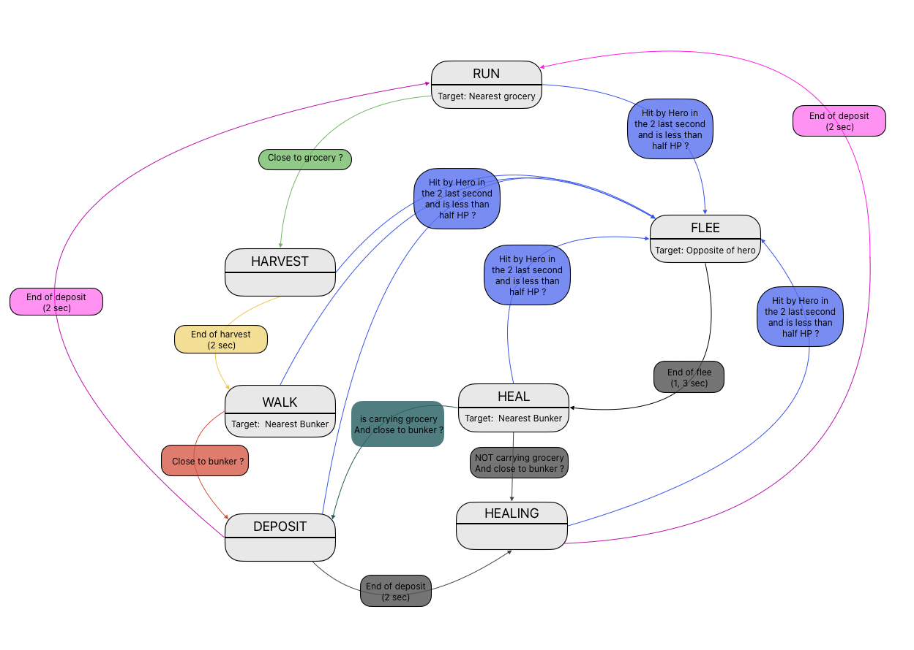

Playable version in browser [here](https://sereal.itch.io/rats)

# Comment jouer

Vous devez défendre les provisions contre les survivalistes.

Déplacez-vous avec ZQSD / WASD / :arrow_up: :arrow_left: :arrow_down: :arrow_right:

Pour gagner, vous devez protéger les provisions jusqu'à l'arrivée des renforts (120 secondes).

Si toutes les provisions sont volées, vous perdez.  
Si vos points de vie atteignent zéro, vous perdez.

## Structure des dossiers

- ***assets*** : Contient les sprites et les polices de caractères.
- ***classes*** : Définitions des objets.
- ***gui*** : Définitions des interfaces graphiques liées aux scènes.
- ***libs*** : Fonctions utilisées dans tout le projet.
- ***managers*** : Gère la logique du gameplay, utilise les classes et gère les scènes.
- ***scenes*** : Définitions des scènes.

## Structure du code

J'ai essayé d'organiser mon code par objet à instancier à l'écran. Vous pouvez trouver tous ces objets avec leurs comportements propres dans le dossier `classes` (Character, Enemy, Boss, Bunker, etc.). J'ai utilisé l'héritage d'objets pour les personnages visibles à l'écran. Par exemple, `Boss` hérite de `Enemy` et `Enemy` hérite de `Character`.

Le dossier `libs` contient des fonctions transversales à tout le code, comme le module `collisions` qui gère les interactions entre deux objets.

Les scènes sont gérées par un *scene manager* qui possède la propriété `currentScene`, ce qui permet de changer de scène depuis n'importe quel module sans avoir à le spécifier dans le `main`. Toutes les scènes ont la même structure, mais la logique varie.

Chaque scène a un fichier GUI associé qui définit les informations affichées à l'écran. La *factory* de la GUI est une classe (issue d'un cours sur Gamecodeur) qui permet de créer différents objets pour l'interface graphique.

La boucle de gameplay est gérée par le manager `Gameplay`, responsable de l'évolution de la boucle et de la vérification des conditions de victoire ou défaite.

Chaque objet présent dans le jeu est géré par un manager dédié, ce qui permet de n'interagir qu'avec ces managers et de les partager entre les modules du projet.

## Machine à états

La machine à états est définie dans la classe `Enemy`, qui doit collecter les provisions.

# How to play

You have to defend the groceries against the survivalists.

Move with ZQSD / WASD / :arrow_up: :arrow_left: :arrow_down: :arrow_right:

To win, you have to protect the groceries until the backup arrives (120 seconds).

If all the groceries are stolen, you lose.  
If your health points reach zero, you lose.

## Folder structure

- ***assets***: Contains sprites and fonts.
- ***classes***: Object definitions.
- ***gui***: GUI definitions related to scenes.
- ***libs***: Functions used across the whole project.
- ***managers***: Manages gameplay logic, uses classes, and handles scenes.
- ***scenes***: Scene definitions.

## Code Structure

I organized my code by objects to instantiate on screen. You can find all these objects with their specific behavior in the `classes` folder (Character, Enemy, Boss, Bunker, etc.). I used object inheritance for the characters that appear on screen. For example, `Boss` inherits from `Enemy`, and `Enemy` inherits from `Character`.

The `libs` folder contains functions used across the entire codebase, such as the `collisions` module, which handles interactions between two objects.

Scenes are managed by a *scene manager* that has a `currentScene` property, allowing scene changes from any module without specifying it in the `main`. All scenes share the same structure, but the logic differs.

Each scene has an associated GUI file that defines what information is displayed on the screen. The GUI factory is a class (based on a Gamecodeur course) that allows creating different objects for the GUI.

The gameplay loop is managed by the `Gameplay` manager, which is responsible for advancing the loop and checking the victory and defeat conditions.

Each object in the game is managed by a dedicated manager, allowing interaction only through these managers, which are shared across the project modules.

## State Machine

The state machine is defined inside the `Enemy` class, which is responsible for collecting the groceries.

